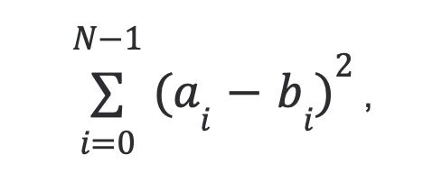

# Домашняя работа № 04
-------------------------------
## Урок 4. Алгоритмы STL

> [Код С++:](main.cpp)

- ### 1. Имеется отсортированный массив целых чисел. Необходимо разработать функцию insert_sorted, которая принимает вектор и новое число и вставляет новое число в определенную позицию в векторе, чтобы упорядоченность контейнера сохранялась. Реализуйте шаблонную функцию insert_sorted, которая сможет аналогично работать с любым контейнером, содержащим любой тип значения.
-------------------------------
- ### 2. Сгенерируйте вектор a, состоящий из 100 вещественный чисел, представляющий собой значения аналогового сигнала. На основе этого массива чисел создайте другой вектор целых чисел b, представляющий цифровой сигнал, в котором будут откинуты дробные части чисел. Выведите получившиеся массивы чисел. Посчитайте ошибку, которой обладает цифровой сигнал по сравнению с аналоговым по [формуле](https://drive.google.com/file/d/1TBulUYemfXxYMkmajbrvAdgfqI41AMRk/view?usp=sharing):

    {: width="300px"} 
    где:
    N - количество элементов в векторе,
    a - элемент вектора с дробными числами, b - элемент вектора с целыми числами
    Постарайтесь воспользоваться алгоритмическими функциями, не используя циклы.
